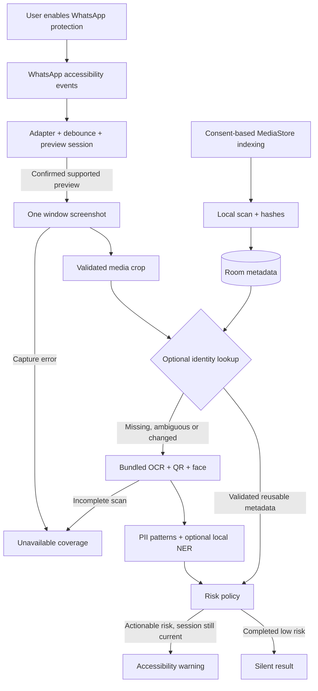

# PrivacyGate Preflight: 23-hour hackathon plan

**Status:** Proposed plan for review; no Android implementation has started.
**Goal:** Demonstrate an event-driven, offline privacy warning for single-image WhatsApp send previews on the supplied iQOO 15.
**Architecture:** A narrowly scoped accessibility adapter confirms a preview, captures one window, extracts the visible image, and runs local detection. A coordinator rejects stale work and displays a warning only for actionable findings. An optional local index accelerates lookup after the live flow works.
**Tech stack:** Kotlin, Jetpack Compose, Material 3, coroutines, Android AccessibilityService, bundled ML Kit, DataStore; Room and perceptual hashing after the core proof; ONNX CPU and Qualcomm QNN only after earlier gates pass.

This is a delivery and architecture plan, not a claim that compatibility, accuracy, latency, or accelerator execution has been demonstrated. Hours are relative allocations starting when implementation begins. If the deadline already includes planning time, subtract that time from optional work.

## Recommendation and assumptions

Proceed with a conditional go. The idea addresses accidental oversharing in an existing user workflow and has an understandable demonstration: normal photo stays quiet, sensitive document produces a warning, and the same check runs offline. The technical differentiation is contextual activation plus local analysis, with an index as a potential optimization. No competitive or novelty claim has been validated.

The full original brief is a longer-term product roadmap. Implementing all of it reliably in 23 hours from an empty workspace is not a credible commitment.

Assumptions:

- One implementation stream with the user available for physical-phone operations.
- The actual iQOO 15 is available from the start, with USB debugging and permission to install the APK and enable the service.
- WhatsApp is installed and usable with a synthetic test conversation; no messages are sent automatically.
- Development internet is available for tools and dependency downloads; runtime media processing is offline.
- NPU execution is desirable rather than a mandatory qualification requirement until the organizer rules establish otherwise.
- Initial supported scope is one visible still image, portrait orientation, the observed WhatsApp build, and English/Latin-script test content.

If NPU is mandatory, confirm the organizer-supported runtime and sample at hour zero. Keep the same product-first order, but do not call the project qualified until real NPU execution passes. A working CPU prototype can otherwise still fail the competition requirement.

## Approach comparison

| Approach | Benefit | Main cost | Decision |
|---|---|---|---|
| Automatic WhatsApp preview warning | Fits the intended user experience and strongest demonstration | Depends on WhatsApp UI structure, capture support, and warning latency | Primary route, subject to hour-four gate |
| Explicit share-to-PrivacyGate preflight | User intentionally supplies the image; easier to control the review flow | Adds a step and changes the automatic-protection promise | Fallback proposal if automatic detection fails |
| OEM/system integration | Potential future path to a true send gate with stronger lifecycle integration | Requires platform/app partnerships or privileged integration | Post-hackathon investigation |

Do not silently substitute the explicit flow and present it as automatic WhatsApp interception.

## Critical limitations that shape the design

1. **There is a send race.** A user can tap WhatsApp Send while capture/OCR is still running. A warning blocks touches only after its overlay is attached and correctly positioned. It does not intercept WhatsApp's outgoing IPC. A pending overlay could reduce part of this race but interrupts safe previews and still cannot guarantee an atomic gate. The default plan preserves silent-safe behavior and presents protection as best-effort warning on supported previews.
2. **The screenshot is visible content only.** It may omit off-screen or cropped image details, tiny unreadable text, EXIF, other attachments, documents, or video frames. Do not claim the whole outgoing payload was scanned.
3. **Perceptual similarity is not identity.** Two documents with different sensitive fields can have similar hashes. A wrong LOW match can suppress a warning, which is more serious than wasted OCR. Never authorize a safe skip solely because one pHash is close. Use the index as a candidate lookup until identity/content validation passes on changed-document negatives; otherwise run the live scan.
4. **Failure is not safety.** Model errors, unreadable crops, secure-window errors, and unsupported states produce UNKNOWN/UNAVAILABLE coverage, not a successful safe scan. Do not inflate safe counters.
5. **WhatsApp compatibility is empirical.** IDs, geometry, event coverage, and OEM service behavior must be observed on the exact device/build. An emulator cannot establish this.
6. **NPU support is a separate integration task.** A CPU INT8 ONNX file is not automatically compatible with QNN HTP. Runtime versions, operators, shapes, precision, libraries, and actual placement must be checked.

## Scope and delivery gates

### Required working core

- Clear accessibility disclosure, explicit enable flow, WhatsApp protection toggle, true service status.
- WhatsApp event filtering and adapter; no continuous capture/OCR and no general app monitoring.
- Debounce, one in-flight scan, preview-session state, cancellation, stale-result rejection.
- One window screenshot per confirmed stable preview/change, correct crop geometry, safe resource cleanup.
- Bundled OCR and actual phone/email pattern detection for the first proof.
- Warning overlay with detected categories, dismiss/continue, and an honest review/back option.
- No auto-send, fake findings, fabricated timing, or claimed NPU without evidence.
- Safe completed checks stay silent. Capture/detection failure remains distinguishable from safe.
- Debug diagnostics, measured timings, and synthetic phone tests including offline first use.

### Planned after core success

- More Indian PII patterns with context and validation; QR and face bounding boxes.
- Optional, explicitly enabled local privacy index using MediaStore and Room.
- pHash candidate search with measured match distances and conservative fallback.
- Fresh WhatsApp camera-image checks, expanded from the live path already built.
- Minimal home/index/diagnostics polish and persisted counters.

### Conditional enhancements

- Semantic PII model on ONNX CPU after core and index tasks are stable.
- QNN/Hexagon execution after the CPU model passes correctness and timing checks.

### Excluded from the 23-hour commitment

Telegram, embeddings, LLMs, continuous monitoring, video/document/multi-attachment coverage, extensive animation, automatic replacement of WhatsApp attachments, facial identification, login, backend, cloud databases, and Play Store launch.

## Schedule: 23 hours total

| Hours | Deliverable | Required evidence / exit decision |
|---|---|---|
| 0-1.5 | Toolchain, single-module app, device connection | Resolve JDK/SDK/ADB; pin compatible Gradle/AGP/Kotlin; assembleDebug; APK launches on physical phone |
| 1.5-4 | Accessibility feasibility | Manual enable works; observed WhatsApp preview signals; successful window capture; correct debug crop; test overlay renders and dismisses |
| 4-7 | First complete privacy warning | Bundled OCR reads synthetic phone/email from captured preview; sensitive warns, clean control stays quiet; repeated callbacks do not repeat scans |
| 7-9 | Broaden privacy engine | Contextual Indian patterns, QR and face; false-positive controls; explicit UNKNOWN path; measured live-camera scan |
| 9-12 | Optional index and matching | Permission-aware MediaStore enumeration; Room metadata; pHash candidates; modified-image invalidation; wrong-image negatives; live fallback |
| 12-14 | Integration and lifecycle reliability | Gallery/camera paths; exit/reopen/change preview; overlay cleanup; service re-enable; bounded retry; offline run |
| 14-17 | Conditional semantic CPU and NPU work | First validate CPU tokenizer/entities/timing; attempt QNN only if stable and supported; otherwise spend block on reliability |
| 17-19 | Product UI and evidence | Minimal polished home, real status and counters, index state, device facts, timing breakdown; no unfinished buttons |
| 19-21 | Feature freeze and acceptance run | Physical-device matrix, cold offline launch, fast-send limitation, false positives, final APK installation |
| 21-23 | Buffer, pitch and rehearsal | Bug fixes only; APK backup; exact demo sequence; architecture slide; recorded genuine run as backup |

**Hard gates:**

- At hour 1.5, if device/toolchain access is still missing, revise expectations immediately.
- At hour 4, if detection/capture/crop is unreliable, do not start index/model work. Use at most two hours from optional work to fix it; if still blocked, propose the explicit preflight pivot.
- At hour 7, first genuine sensitive warning and silent clean control must work. If they do not, all later feature work pauses.
- At hour 12, if matching is uncertain, disable cache-based scan skipping and retain live scanning. Do not hide this from the demo.
- In the 14-17 block, allocate up to two hours to CPU semantic integration and at most the remaining hour to a prepared NPU path. Do not spend hours assembling a proprietary toolchain without the user's approval, as requested in the original brief.
- At hour 19, freeze features regardless of remaining wish-list items.

Earlier delays consume optional features, not the final four hours of testing and presentation. No promise is made that both semantic NER and NPU will fit.

## Work packages and file boundaries

All Kotlin production paths below are under `app/src/main/java/com/privacygate/app/`. Keep one Gradle app module and simple constructor-based dependency wiring.

### A. Foundation and onboarding

Files: `settings.gradle.kts`, `build.gradle.kts`, `gradle/libs.versions.toml`, wrapper files, `app/build.gradle.kts`, `app/src/main/AndroidManifest.xml`, `MainActivity.kt`, `ui/HomeScreen.kt`, `settings/ProtectionPreferences.kt`.

- [ ] Locate/install compatible tools; read actual phone model, Android API and WhatsApp version.
- [ ] Set package `com.privacygate.app`, compile/target SDK 36, min SDK 30 with guarded API-34 window capture. If SDK 36 setup is blocked, resolve or document it rather than silently selecting a different target.
- [ ] Create Compose Material 3 app, dark charcoal theme, one accent, disclosure and Accessibility Settings button.
- [ ] Show protection enabled only when the setting and service connection agree; show paused/disconnected honestly.
- [ ] Omit INTERNET permission from the app and inspect the merged manifest for transitive additions. Exclude private index/settings data from cloud backup.
- [ ] Build, install, open on phone, record observations and commit the working baseline.

### B. Preview detection and diagnostic proof

Files: `protection/PrivacyGateAccessibilityService.kt`, `protection/adapters/ProtectedAppAdapter.kt`, `protection/adapters/WhatsAppAdapter.kt`, `protection/ProtectionStateMachine.kt`, `app/src/main/res/xml/privacy_accessibility_service.xml`, debug-source-set `ui/DebugScreen.kt` and `diagnostics/DebugStore.kt`.

- [ ] Declare BIND_ACCESSIBILITY_SERVICE, window-content and screenshot capabilities; use report-view-IDs and interactive-windows flags.
- [ ] Start with WhatsApp window-state/content events. Add focused/clicked signals only when observed evidence makes them necessary.
- [ ] Capture a bounded structural diagnostic snapshot on demand: IDs, classes, bounds and signal booleans. Avoid raw editable text; content descriptions can also contain PII and need sanitization.
- [ ] Infer preview using a combination of media area, caption/edit controls, send region, activity/window structure and observed IDs. Never rely on a Send string alone.
- [ ] Reject chat composer, gallery grid, image viewer, camera live view and ambiguous layouts.
- [ ] Test multiple opens, cancellation, and changed media on the actual WhatsApp build.

### C. Capture, crop and session control

Files: `protection/ProtectionCoordinator.kt`, `protection/capture/WindowScreenshotProvider.kt`, `protection/capture/MediaPreviewRegionDetector.kt`.

- [ ] Maintain a monotonically changing preview-session/generation token and one active scan job.
- [ ] Debounce structural events, revalidate the window, then capture once. Caption-only changes should not repeatedly trigger image scans.
- [ ] Use takeScreenshotOfWindow on API 34+. Allow display fallback only after validating the active package/window and only for eligible non-secure failures.
- [ ] Never use fallback to bypass secure content. Close hardware buffers and release intermediate bitmaps on success, error and cancellation.
- [ ] Transform screen-space node bounds to captured-window bitmap coordinates; account for origin, scale, insets, rotation and keyboard layout. Clamp bounds and reject empty/implausible crops.
- [ ] Retain only the latest debug crop in memory, with explicit clear and short lifetime. Production does not save captures.
- [ ] Before publishing a result, recheck preview generation and active window; discard stale callbacks. Release overlays on preview exit, app switch, disconnect and protection disable.
- [ ] Use bounded retries for transient screenshot errors, never frame polling. Verify media changes produce a new session; if the adapter cannot detect a class of changes, mark that case unsupported.

### D. Local scan and warning

Files: `model/SensitiveItem.kt`, `model/PrivacyScanResult.kt`, `ai/PrivacyInferenceEngine.kt`, `ai/ocr/MlKitOcrDetector.kt`, `ai/pii/PatternDetector.kt`, `ai/vision/QrDetector.kt`, `ai/vision/FaceDetector.kt`, `risk/RiskEngine.kt`, `protection/overlay/RiskOverlayController.kt`.

- [ ] Return normalized boxes, type, detector source and optional ephemeral text; add scan completeness/error status independently of LOW/MEDIUM/HIGH/CRITICAL.
- [ ] First run bundled Latin OCR plus phone/email patterns on actual captured pixels. The temporary proof warns on these findings regardless of the future weighted risk threshold; label it a proof policy.
- [ ] Replace the proof policy with a versioned product policy after adding contexts. Avoid the original numeric weights making a single strong financial finding silently non-actionable.
- [ ] Add UPI, PAN-like, Aadhaar-like, IFSC, card checksum and contextual account patterns; names/addresses need explicit context rules until NER is implemented.
- [ ] Use general pattern logic rather than matching predetermined synthetic strings. Never label context rules as NER_MODEL.
- [ ] Deduplicate overlapping detections; bare QR/face/URL is not automatically high risk. Payment payload/context can elevate QR risk.
- [ ] Preserve OCR span-to-box mapping. Keep detected values out of logs, persisted counters and Room.
- [ ] Overlay displays categories and user-controlled dismissal; dismissing never triggers WhatsApp Send. Use Review/Back only if those actions are functional; omit Protect until redaction is implemented.
- [ ] Report CPU for known CPU work and UNKNOWN for opaque ML Kit device placement; expose per-stage backend/runtime details rather than one misleading NPU badge.

### E. Optional index

Files: `index/PrivacyAssetEntity.kt`, `index/PrivacyAssetDao.kt`, `index/PrivacyIndexDatabase.kt`, `index/PrivacyIndexRepository.kt`, `index/PerceptualHashEngine.kt`, `index/ImageMatcher.kt`, `ui/IndexScreen.kt`.

- [ ] Request explicit indexing consent and current Android media access. Support denied, full and selected access; query only accessible local media and recheck permissions on resume.
- [ ] Start with a small accessible test collection, one image at a time in a user-visible coroutine job with cancellation. Do not promise persistent background indexing before implementing it.
- [ ] Normalize orientation; downsample safely. Store content URI, MediaStore identity/version, dimensions, hashes, scanner/model/policy versions, risk categories and normalized regions.
- [ ] Store no source image copies or sensitive OCR values. Remove stale inaccessible/deleted entries and invalidate modified media and changed model/policy versions.
- [ ] Measure Hamming distance over known matches and unrelated/near-identical documents. Calibrate against held-out images, including changed account/phone fields.
- [ ] Require an ambiguity margin and additional content/geometry validation; distance is not a calibrated probability. Never skip a live scan based on a nearest hash alone.
- [ ] Uncertain identity, edits, stale metadata, missing index and direct camera images all use the live scan. Cache hit timings must include actual lookup/validation costs.

### F. Conditional semantic/NPU enhancement

Files only when this gate is reached: `ai/pii/NerDetector.kt`, `ai/pii/OnnxNerDetector.kt`, `ai/pii/Tokenizer.kt`, `ai/pii/BioDecoder.kt`, `ai/pii/QnnNerDetector.kt`, `benchmark/BenchmarkRunner.kt`, bundled assets and model notices.

- [ ] Inspect the model card, assets, license and label map. Pin the artifact revision and hash.
- [ ] Match reference tokenization including special tokens, casing, punctuation, truncation and offsets. Reconstruct BIO entities and map spans back to OCR boxes.
- [ ] Test CPU on synthetic names/addresses and negatives, then benchmark cold load and warm inference separately.
- [ ] Assess organizer/runtime support for Android ARM64 QNN; do not assume a desktop install or CPU quantized graph suffices.
- [ ] Validate model shapes/operators/precision; compare entity outputs to CPU. Inspect provider assignment/profiling and detect fallback.
- [ ] Expose Hexagon NPU only for confirmed executing stages. Preserve a functioning CPU fallback and disclose mixed execution.

## Tests and evidence

Use synthetic data only. Include example.com email addresses, clearly labelled fake documents, nonpayable test QR payloads, and unrelated controls. Never submit payments or send messages automatically.

Unit tests should cover behavior: pattern false positives, deduplication/risk policy, state transitions, stale result rejection, crop coordinate mapping, and matching negatives. Instrumented tests can check Android lifecycle/resource paths, but physical WhatsApp verification is mandatory.

| Scenario | Acceptance evidence |
|---|---|
| Clean gallery image | Preview detected; one completed scan; no warning |
| Sensitive gallery image | Real findings from pixels; visible warning with correct categories |
| Fresh WhatsApp camera image | No required index entry; live scan runs and detects legible synthetic fields |
| Lots of benign numbers/text | No spurious high-risk warning for the selected negative corpus |
| Ordinary chat, scrolling, camera view | No expensive scan outside a confirmed supported preview |
| Many callbacks on same preview | At most one scan for that stable session; no repeated overlay |
| Change image or leave mid-scan | Old result cannot warn over new media or another app |
| Immediate send attempt | Record whether a race exists; never stage results to imply a guarantee |
| Similar documents with changed fields | No unsafe reuse of LOW metadata |
| Permission denied/revoked/selected | Correct index scope; no crash or access bypass |
| Screenshot/OCR failure | UNKNOWN/UNAVAILABLE, not a safe count |
| Airplane mode first launch | Bundled detection works without a first-use model download; Wi-Fi also off |
| Overlay continue/back | User stays in control; no automatic send; cleanup verified |
| Screen lock, re-enable, app restart | Honest state and recovery; no stale image or overlay |

Target at least ten repeated runs each of clean gallery, sensitive gallery and fresh camera scenarios. Record success/failure counts and actual conditions; a small synthetic test set is not a population accuracy claim.

Measure event-to-confirmation, capture, crop, OCR, rules, optional index/NER, and event-to-overlay with monotonic time. Proposed usability goal: warm live warning within about one second; this is an engineering target, not a prediction or measured result. Report actual median, worst observed and sample count, separating cold runs. Count captures and inference jobs during a five-minute ordinary-chat/idle test to check event-driven behavior. Do not infer battery savings from architecture alone.

At each milestone run appropriate unit tests, `gradlew.bat assembleDebug`, install with ADB, test on the phone and commit only the verified working state. Run lint and the final merged-manifest review before freezing the APK. Preserve explicit PASS/FAIL/NOT TESTED status in milestone reports.

## Demo and deliverables

Suggested three-minute story:

1. Explain accidental document oversharing and show real protection status.
2. Attach a clean image: no interruption.
3. Attach a synthetic sensitive document: warning with concrete categories.
4. Capture a new synthetic document from WhatsApp camera: live scan warning.
5. Show the scan working with network connections off; explain that sending a message still requires connectivity.
6. Show measured stage timings, actual device properties and backend evidence. Show index benefit only if validated; show CPU honestly if NPU was not integrated.

Deliver final APK, source, pinned dependency versions, README setup, synthetic fixtures, test matrix, timing results, known limitations, concise architecture slide and a recording of a real run as backup. A debug APK used for the demonstration must be identified as such and must not persist private captures. A release/demo build should hide debug tools.

## Beyond the hackathon

1. Validate the supported single-image workflow across WhatsApp versions, device layouts, languages and OEM lifecycle policies; measure missed previews and warning latency.
2. Build an explicit original-image review/redaction path: solid masks, user review, metadata stripping and a new exported image shared intentionally through Android Sharesheet. A screenshot crop must not be represented as a full-quality sanitized original, and WhatsApp's existing attachment is not silently replaced.
3. Strengthen index identity/content checks, incremental indexing, permission revocation handling, metadata protection and model evaluation on Indian document layouts.
4. Integrate NER/NPU with output parity, thermal and cold-start measurements; add embeddings only if measured matching failures justify them.
5. Assess accessibility distribution requirements, consent and privacy policy before Play submission. Investigate OEM/app partnership for stronger integration and send guarantees.
6. Add Telegram only after WhatsApp meets a written stability bar; add video/document/multi-image support as separate evaluated features.

## High-level architecture

No background frame loop, remote inference or automatic send action. All expensive work follows a confirmed preview event or explicit index request.

## Technology decisions

| Layer | Choice |
|---|---|
| Language/UI | Native Kotlin, Jetpack Compose, Material 3 |
| Build | Single Gradle module, Kotlin DSL, version catalog; mutually compatible pinned AGP/Gradle/Kotlin chosen after toolchain validation |
| SDK | compileSdk/targetSdk 36; minSdk 30; API-34 guard for window screenshot |
| Trigger | AccessibilityService, WhatsApp adapter, state machine |
| Capture/overlay | takeScreenshotOfWindow, software Bitmap processing, TYPE_ACCESSIBILITY_OVERLAY |
| Execution | Coroutines with bounded concurrency and cancellation |
| Vision | Bundled ML Kit Latin text recognition, barcode scanning and face detection |
| PII/risk | Kotlin patterns, checksum/context rules, explicit versioned risk policy |
| Settings/counters | DataStore with real measurements; no OCR values |
| Index | Room, MediaStore, Kotlin pHash after core proof |
| Semantic stretch | ONNX Runtime CPU plus verified tokenizer and BIO parsing |
| NPU stretch | Compatible Qualcomm QAIRT/QNN HTP path with execution evidence |
| Testing | JVM unit tests, Android instrumentation where useful, ADB and physical WhatsApp acceptance runs |
| Network/backend | None required for core runtime |

## Source checks

- Window screenshot is available from API 34; Android documents screenshot capabilities and failure codes: [AccessibilityService reference](https://developer.android.com/reference/android/accessibilityservice/AccessibilityService#takeScreenshotOfWindow(int,%20java.util.concurrent.Executor,%20android.accessibilityservice.AccessibilityService.TakeScreenshotCallback)).
- Bundled text recognition statically includes its model; use the bundled dependency for immediate availability: [ML Kit Android text recognition](https://developers.google.com/ml-kit/vision/text-recognition/v2/android). QR and face also offer bundled options: [model installation paths](https://developers.google.com/ml-kit/tips/installation-paths).
- Android 14+ supports selected-photo access; indexing must respect the currently granted scope: [partial photo access](https://developer.android.com/about/versions/14/changes/partial-photo-video-access).
- The proposed HikmaAI model card lists approximately 66M parameters, a 129 MB INT8 ONNX artifact, Apache 2.0 licensing, and six training languages excluding Hindi. Treat it as a candidate, not proof of Indian-document accuracy or NPU compatibility: [model card](https://huggingface.co/HikmaAI/hikmaai-distilbert-pii).
- QNN documentation describes Android acceleration and model constraints. The newer project also documents an Android ARM64 Maven package. Verify the actual compatible version set and phone execution before adoption: [ORT QNN](https://onnxruntime.ai/docs/execution-providers/QNN-ExecutionProvider.html), [current QNN project](https://github.com/onnxruntime/onnxruntime-qnn/blob/main/docs/execution_providers/QNN-ExecutionProvider.md).
- Apps using accessibility without qualifying as disability tools need prominent disclosure/consent and a Play declaration. A hackathon installation does not prove public distribution approval: [Google Play accessibility requirements](https://support.google.com/googleplay/android-developer/answer/10964491).

## Milestone report: planning

COMPLETED: Empty workspace established; scope, architecture, schedule, risk gates and acceptance tests documented; primary platform/model documentation checked.
FILES CHANGED: This plan only.
BUILD: NOT RUN in this planning phase; previous attempt failed because the new project has no Gradle wrapper.
PHYSICAL DEVICE TEST: NOT TESTED.
ACTUAL OBSERVATIONS: No project exists; prior environment check did not find Java/ADB/Gradle on PATH or the default Android SDK. This does not prove they are absent elsewhere.
KNOWN PROBLEMS: Physical preview/capture feasibility, toolchain setup, event coverage, send race and actual NPU path remain unverified.
NEXT: Review the proposed scope; on implementation authorization, begin toolchain and physical-device feasibility work.
